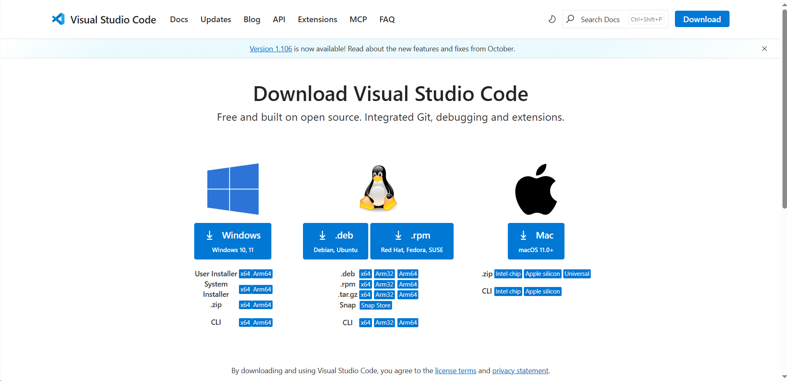
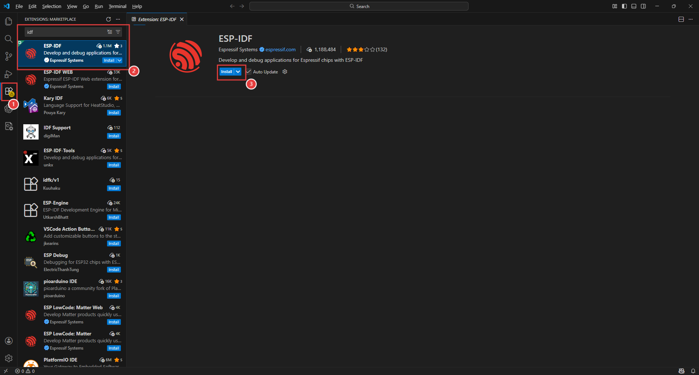
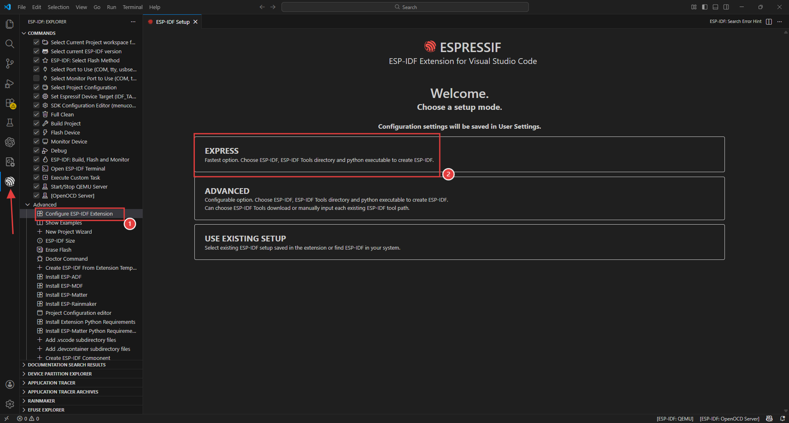
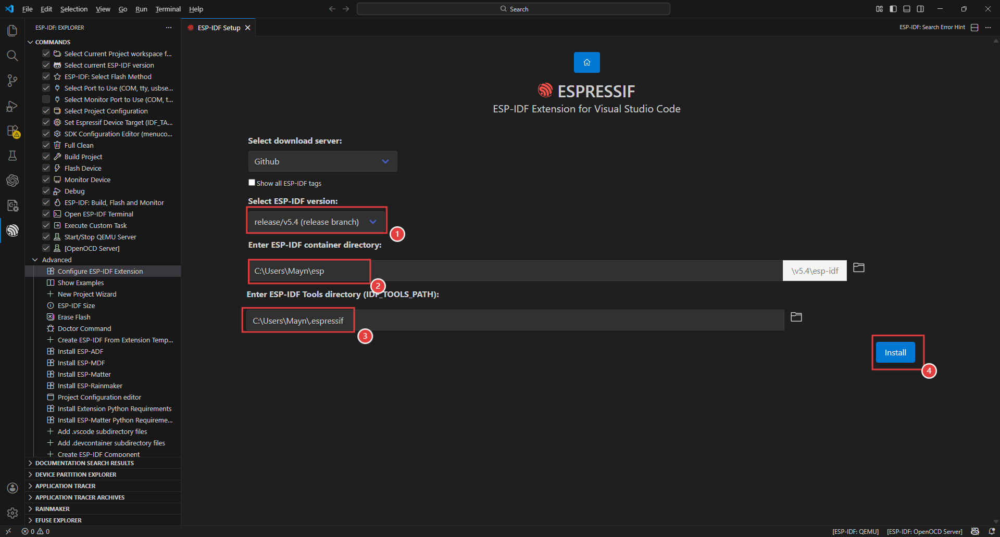
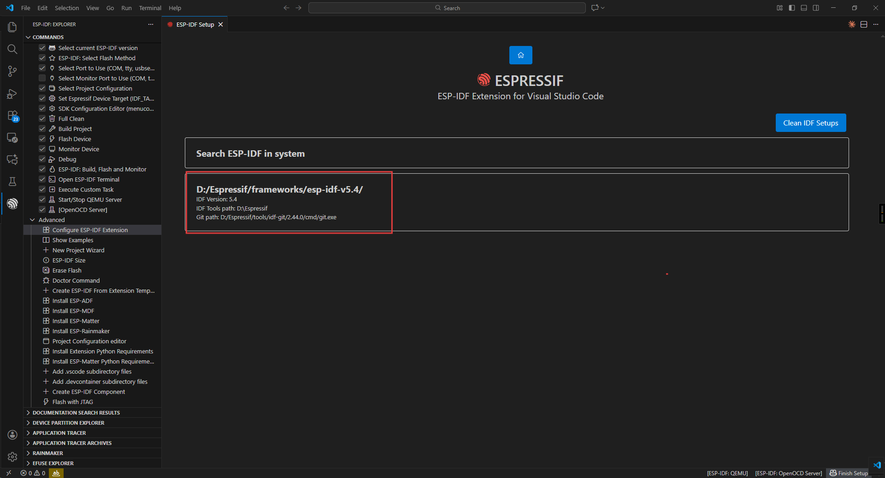

.. _idf_install:

ESP-IDF Development Environment Setup
##############################################

Installing VSCode and ESP-IDF Extension
=======================================
First, open the VSCode official website https://code.visualstudio.com/download and select the appropriate system and architecture for download and installation.

After downloading, run the installer. Once installed, open VSCode and search for "esp-idf" in the Extensions panel on the left side, then install the ESP-IDF extension.

After installation is complete, click on the IDF extension icon on the left side, open Advanced, then select "Configure ESP-IDF extension" and click EXPRESS.

Select an appropriate download server and ESP-IDF version (we choose 5.4 here), then click Install to download and install. It will automatically install the corresponding tools and environment. Please wait a moment.

After installation is complete, you will see the following interface, indicating successful installation.

.. image:: img/vscode5.png

If you have previously installed an offline IDF, you can directly import the plugin without re-downloading.

.. image:: img/vscode6.png

