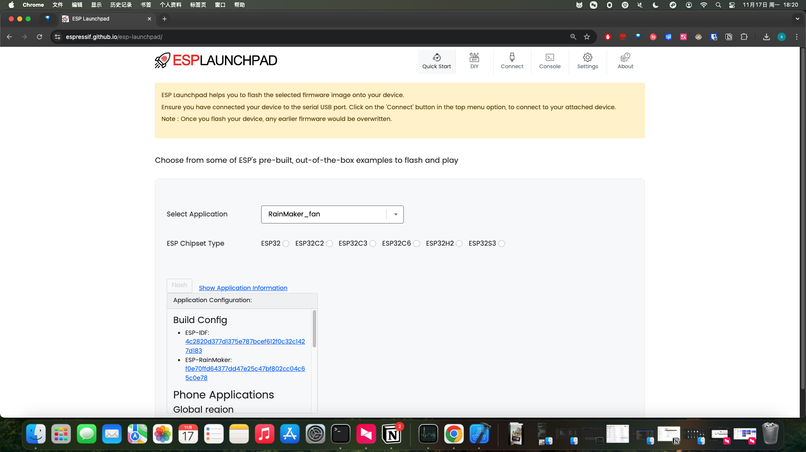
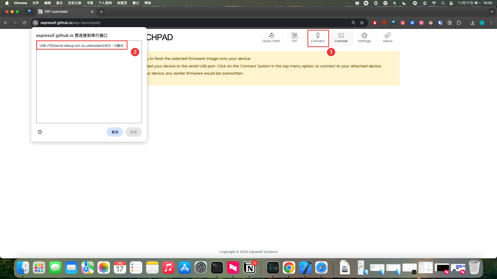
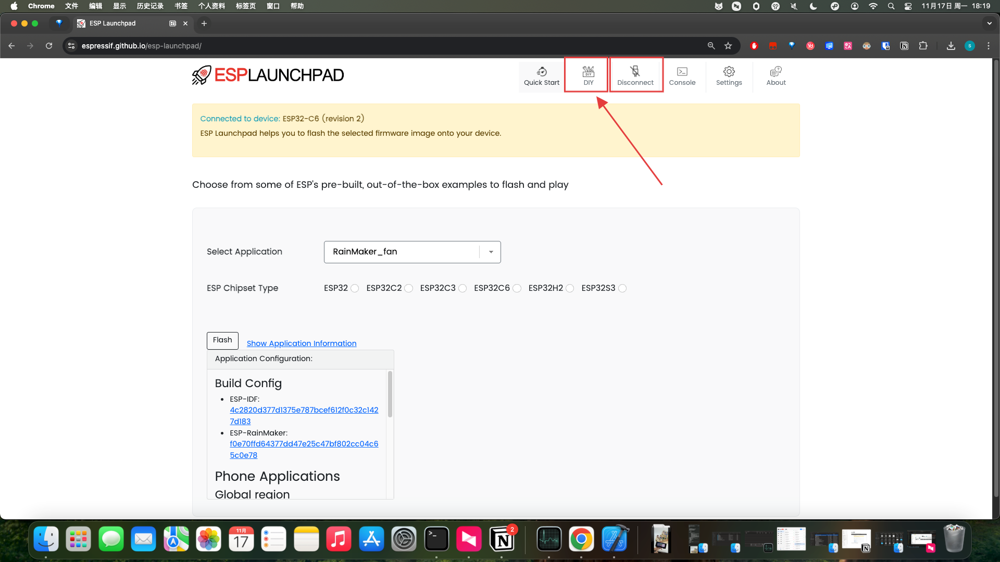
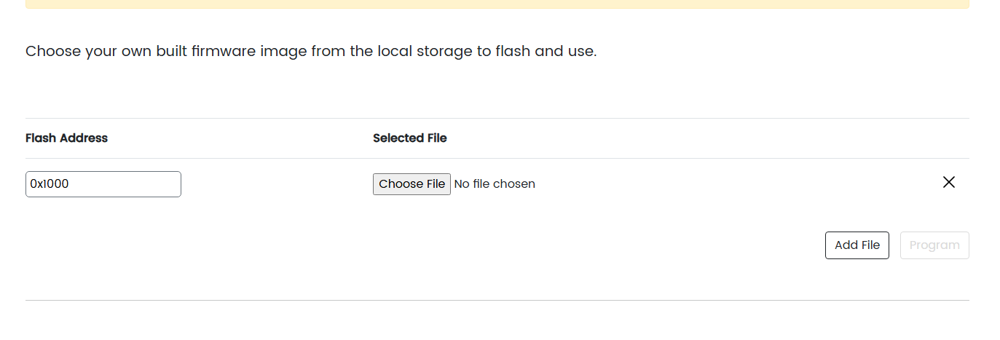
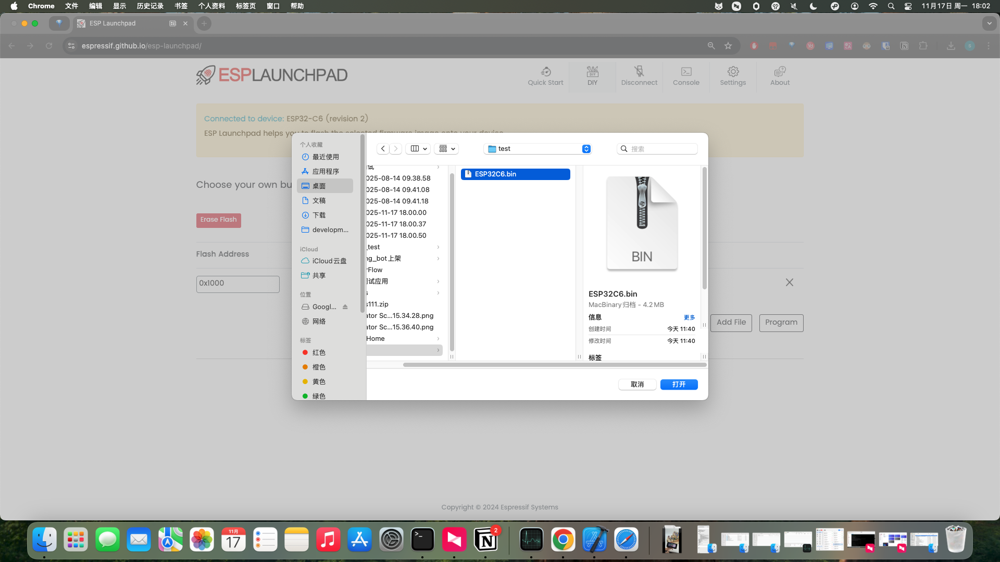
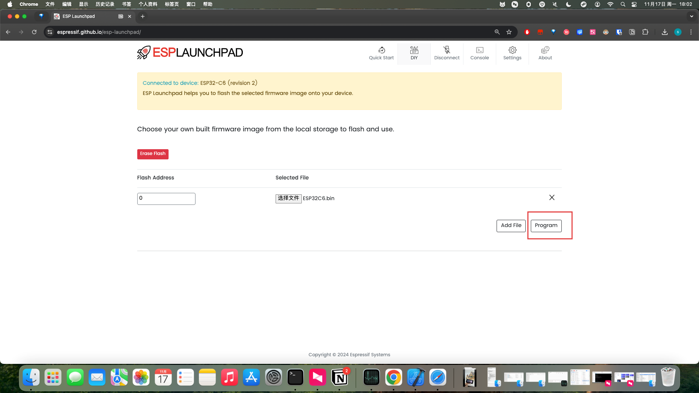
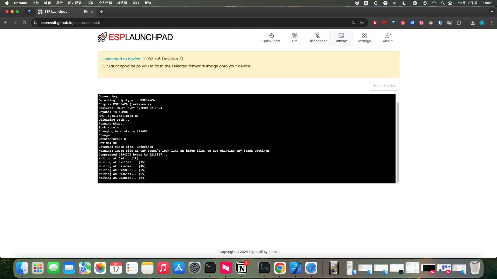
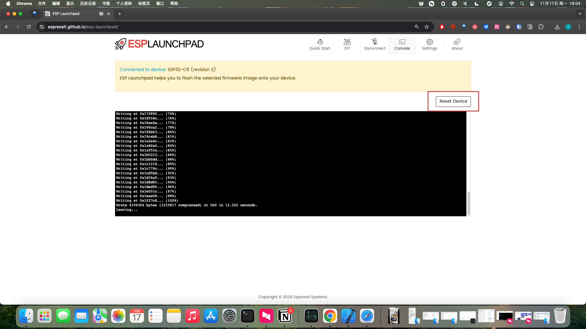
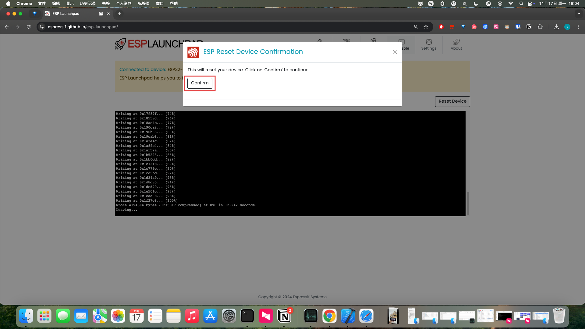

.. _macos_upload:

MacOS/Linux Firmware Upload
============================

1. Download the code to your local machine

.. figure:: img/macos0.png
   :align: center

2. We have stored the bin files in the Firmware folder

.. figure:: img/macos1.png
   :align: center

3. We need to prepare a Type-C to USB-A data cable to connect your Mac computer and the development board

4. You only need to use Chrome or Edge browser to open this website https://espressif.github.io/esp-launchpad/

5. Click the Connect button at the top, and a window will pop up on the left side to select your device and connect

6. After the connection is complete, you can see that the Connect button changes to Disconnect, indicating successful connection. We click the DIY button

7. Fill in 0 in the Flash Address field, and select Firmware in the Selected File section

8. After selection is complete, click the Program button to start flashing

9. After flashing is complete, click the Reset Device button in the upper right corner to restart the device, and you will see the screen display normally

