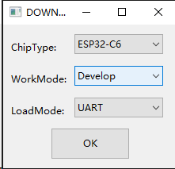
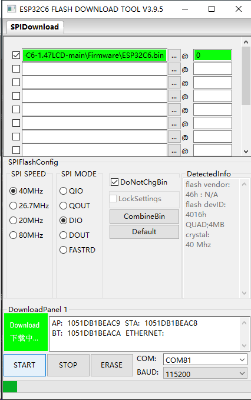
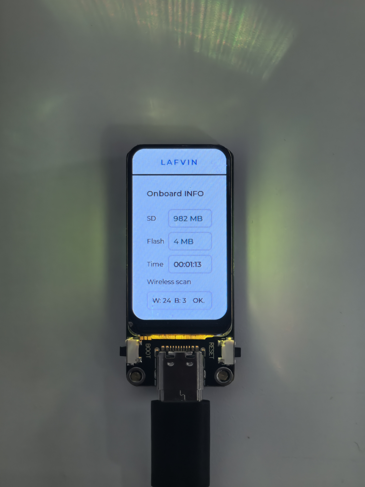

.. _assembly_tutorial:

1. Quick Start Guide
====================
This chapter will guide you to quickly get started with the ESP32-C6-LCD-1.47 development board.

You need to prepare the following tools:

- ESP32-C6-LCD-1.47 development board
- Type-C data cable x1
- Memory card x1
- Card reader x1

After receiving the product, you can use the included type-C cable to power on by inserting it into the ESP32-C6 module's type-C port. Normally, the product will automatically light up and display the Onboard Info interface as shown below.

.. image:: img/demo1-4.png

If it does not light up automatically, you need to download the firmware and flashing tool according to this chapter.

:ref:`Download Code <download_code>` 

Then follow the steps below to flash the code to the device.

Firmware Upload (Windows)
----------------------------
1. Double-click to open Flash Download Tools, then select the options as shown below:

2. Follow these steps to upload the firmware:

    A. Click the “Select File” button to choose your downloaded firmware file (.bin format)
    
    B. In the address input box after the bin file selection box, enter 0 or 0x0 (this means the firmware will be downloaded to the starting position of the development board’s memory)
    
    C. Select the COM port corresponding to ESP32-C6 from the port selection dropdown menu (you can check it in Windows Device Manager)
    
    D. Set the baud rate (we use 115200 here)
    
    E. Click the “START” button to begin downloading the firmware to the ESP32-C6 development board

3. After the firmware upload is complete, you will see the Onboard Info interface, indicating that the flashing was successful.

.. image:: img/demo1-4.png

You can copy the pictures in the SD Card File folder to the memory card, then insert the card. After pressing the RST button to restart, the ESP32-C6-LCD-1.47 development board will automatically read the pictures and display them in a slideshow on the screen.

.. image:: img/pic1.jpg

Then press the boot button to switch to the LVGL interface. In this interface, you can see the capacity of the memory card, the size of the Flash, the run time, as well as the number of scanned Bluetooth and WiFi APs.

If you do not have a Windows computer, but only have a macOS or Linux computer, you can refer to the following tutorial:

:ref:`macos_upload <macos_upload>` 