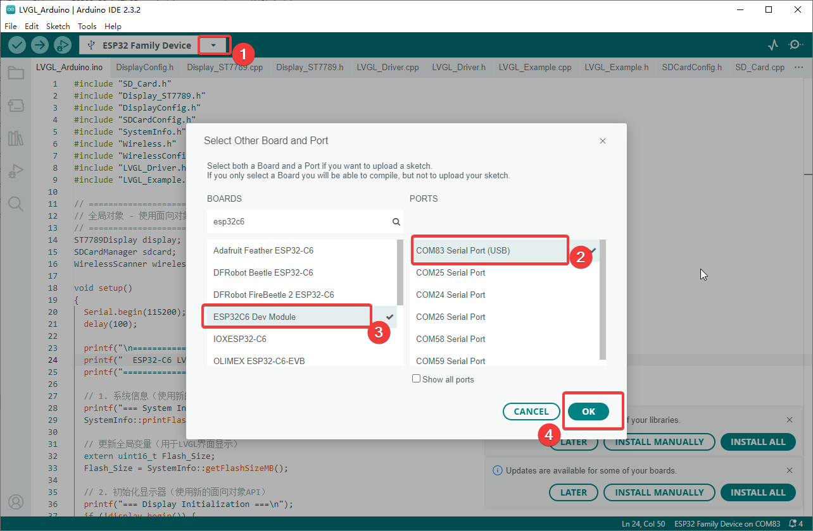
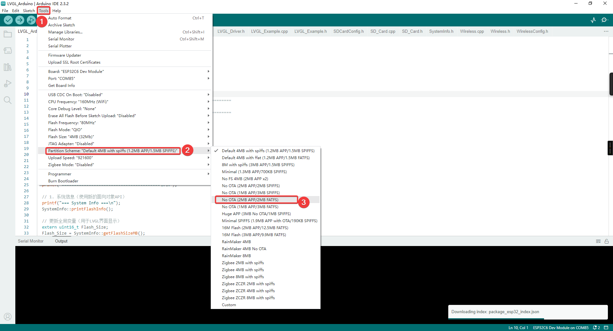
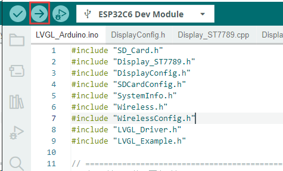
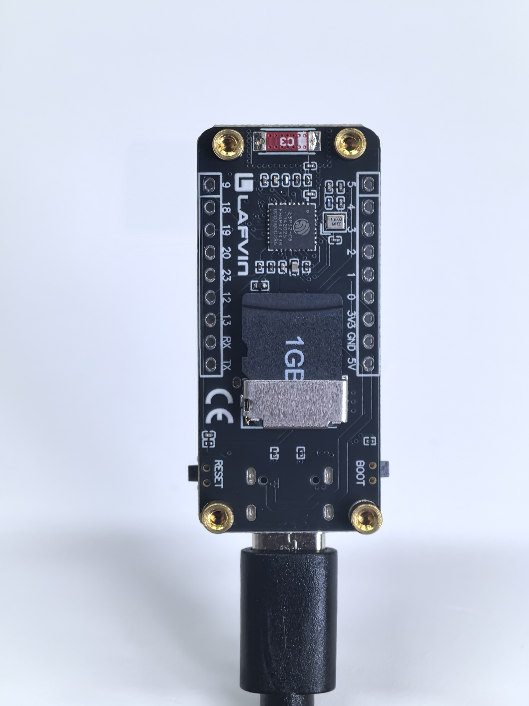
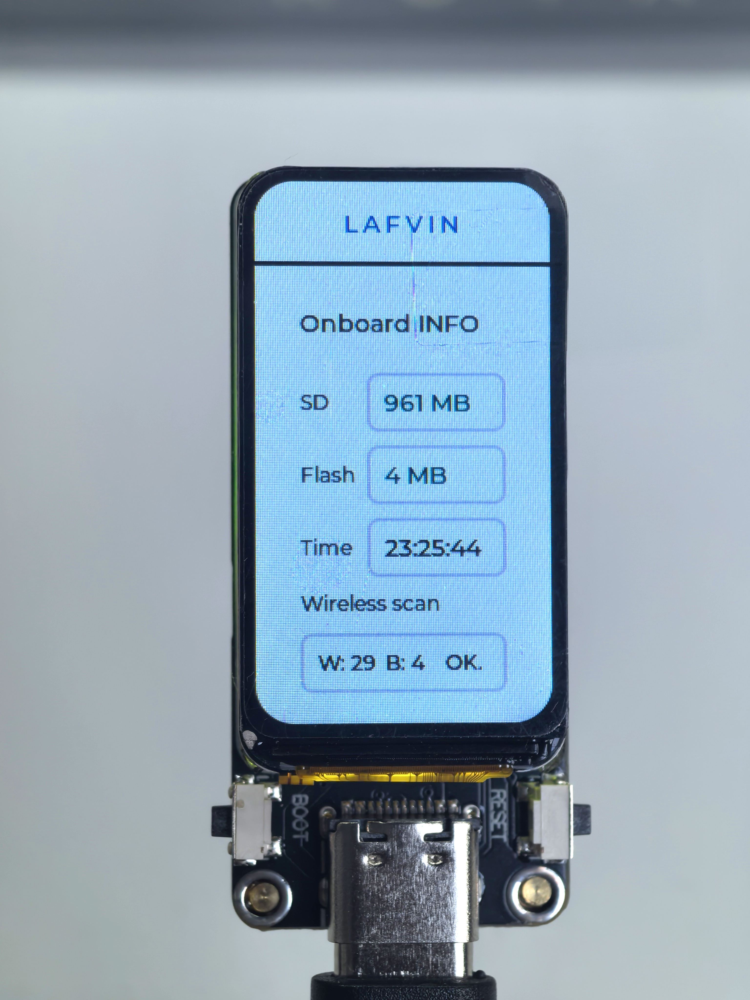
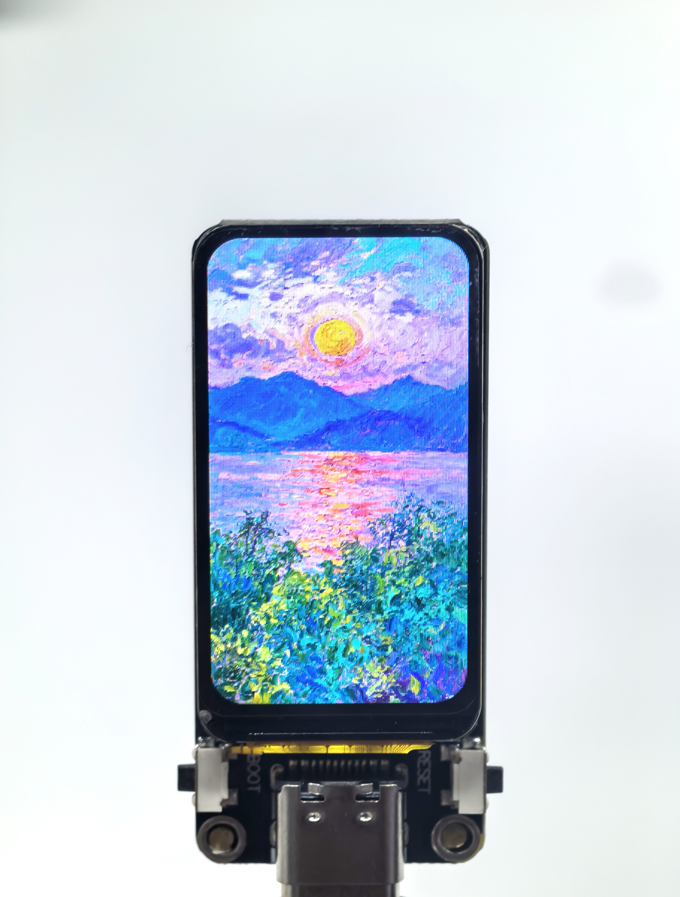
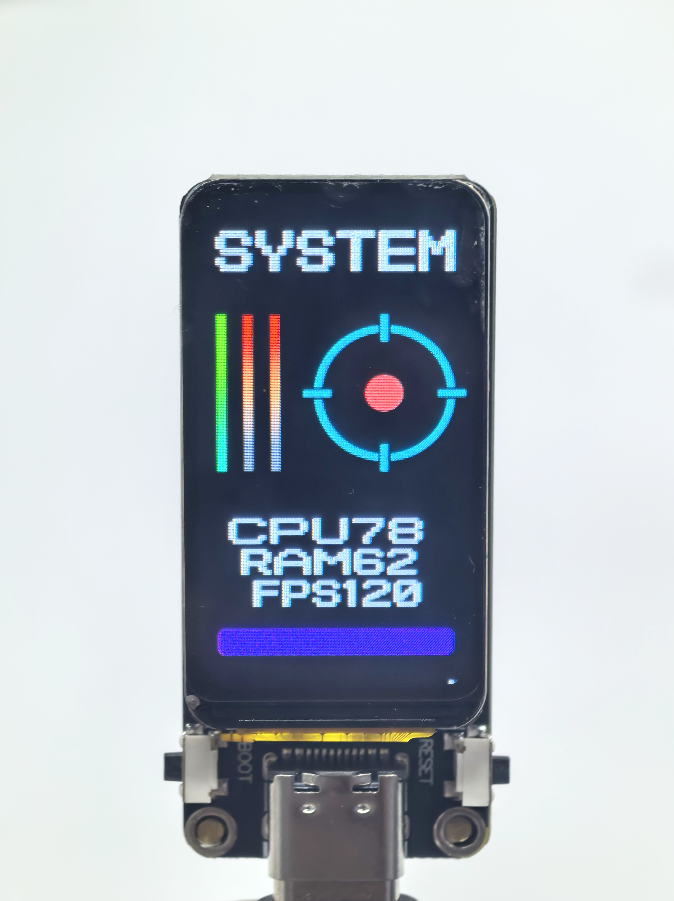
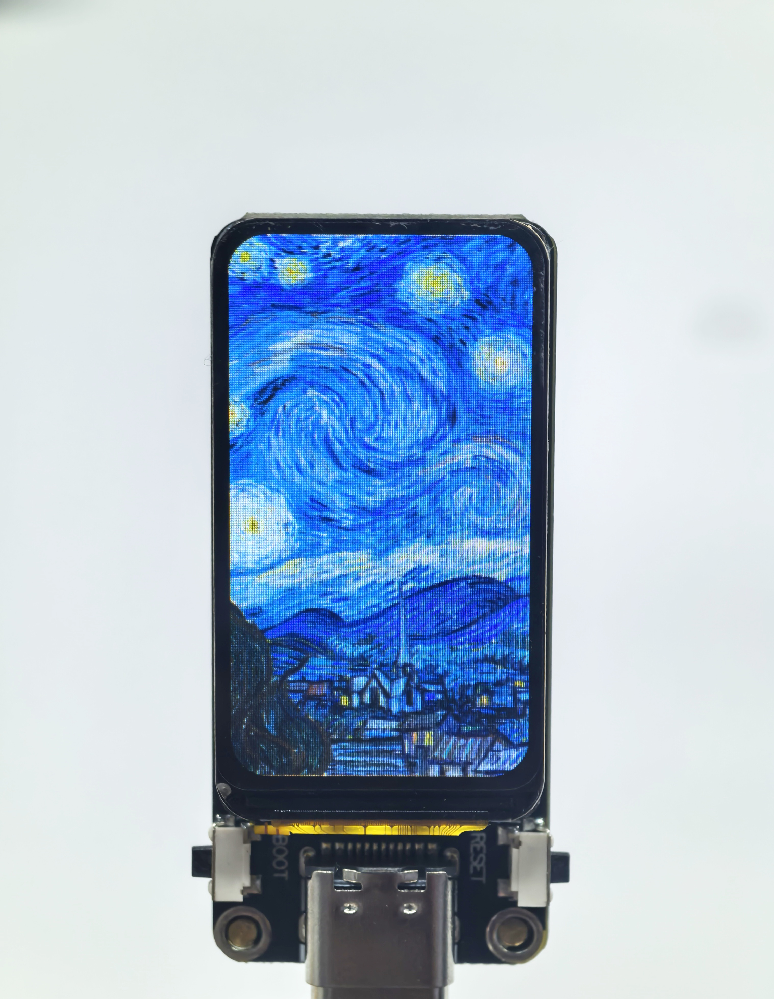

2. Arduino
================

First, in this section, we need to download the Arduino IDE. You can follow the steps in the section below to install it.

:ref:`install_arduino_ide <install_arduino_ide>`

After installing Arduino IDE and configuring the ESP32 library according to this tutorial, we can install the libraries required for this project.

Installing Project Libraries
-----------------------------
You can install the libraries in Arduino by yourself. We also provide related offline zip files. After downloading the code, you can find these two library files in the libraries folder.

You need to open Arduino ‣ Sketch ‣ Include library ‣ Add .zip Library.

.. image:: img/add_ziplib.png

Then in the pop-up window, select our offline library files and click install. After that, you can start compiling our project.

Compile Arduino Project
-----------------------
Let's take the LVGL_Arduino project as an example. Double-click to open LVGL_Arduino.ino. The system will automatically open Arduino IDE. Then, set the port and board type as shown in the images below.

Note: Make sure the development board is connected to the correct port. You can find the port number in Device Manager.

We also need to adjust the partition table: Click Tools in the upper left corner > Select Partition Scheme > Select No OTA (2MB APP/2MB FATFS).

After configuration, click the right arrow button in the upper left corner to start compiling and uploading (this project uses LVGL, which may take a long time, so please be patient).

LVGL_Arduino
----------------
The function of this demo is to test the onboard devices. It requires the LVGL library. After uploading, the device will display SD card capacity, Flash size, running time, and the number of nearby Bluetooth and WiFi devices.

Hardware Connection
^^^^^^^^^^^^^^^^^^^^^^^^^
Insert the SD card into the development board and connect the board to your computer.

Code Analysis
^^^^^^^^^^^^^^
.. code-block:: C++

    1. Get system information
    SystemInfo::printFlashInfo();        // Print Flash capacity information
    Flash_Size = SystemInfo::getFlashSizeMB();  // Update the global variable for LVGL display

    2. Initialize the display
    display.begin();                     // Initialize the ST7789 LCD display
    display.setBacklight(60);            // Set backlight brightness to 60%

    3. LVGL graphics library initialization
    Lvgl_Init();                         // Initialize LVGL core, buffer, and display drivers

    4. SD card initialization
    sdcard.begin();                      // Initialize SD card file system
    SDCard_Size = sdcard.getSizeMB();    // Update the global variable for LVGL display

    5. LVGL UI creation
    wireless.scanAsync();               // Start WiFi and BLE scanning task asynchronously

    6. Wireless scan status update
    if (wireless.isFinished()) {
        WIFI_NUM = wireless.getWiFiCount();     // Update number of WiFi devices
        BLE_NUM = wireless.getBLECount();       // Update number of BLE devices  
        Scan_finish = true;                     // Mark scan as completed
    }

    7. LVGL event handling
    Timer_Loop();                        // Handle LVGL timers, redraw, animation, etc.
    delay(5); 

Run Result
^^^^^^^^^^^^^^

LVGL_Image
----------------
The function of this demo is to display a slideshow of PNG files in the SD card. It requires the PNGdec library. After uploading, the device will display PNG files from the SD card in a slideshow.

Image Preparation
^^^^^^^^^^^^^^^^^^^^
Copy the provided images to the SD card, or add your own images (must be 172x320 pixels, PNG format).

.. .. image:: img/demo2-1.png 暂时空

Hardware Connection
^^^^^^^^^^^^^^^^^^^^
Insert the SD card into the development board and connect the board to your computer.

Code Analysis
^^^^^^^^^^^^^^
.. code-block:: C++

    1. searchImages() // Clear the list → Use SD card manager to search for .png files → Save to imageFileList

    2. displayImage() // Check the list → Build file path → Call showImage()

    3. showImage() // Open PNG file → Decode line by line → Convert to RGB565 format → Draw to LCD
    pngOpen()  // Open SD card file
    pngRead()  // Read file data
    pngSeek()  // Seek file position
    pngDraw()  // Draw line by line to LCD (byte order conversion: big endian → little endian)
    pngClose() // Close file

    4. autoPlayImages() // counter++ → After 300 times → Switch to next image → Loop

Run Result
^^^^^^^^^^^^^^

