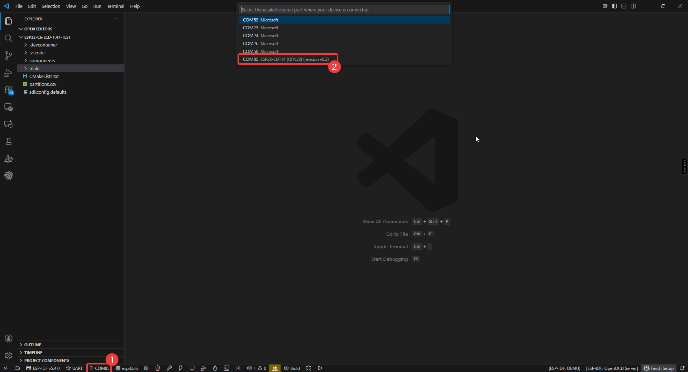
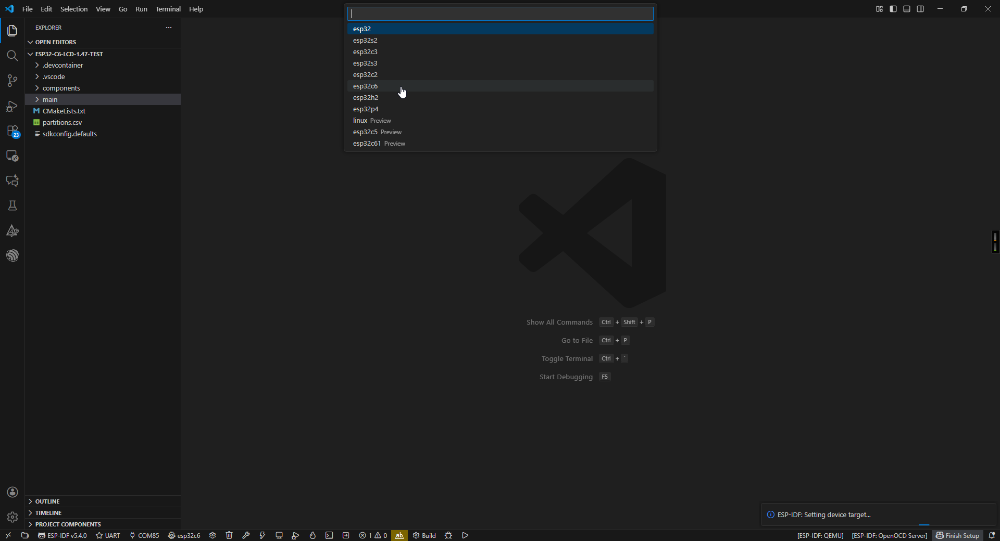
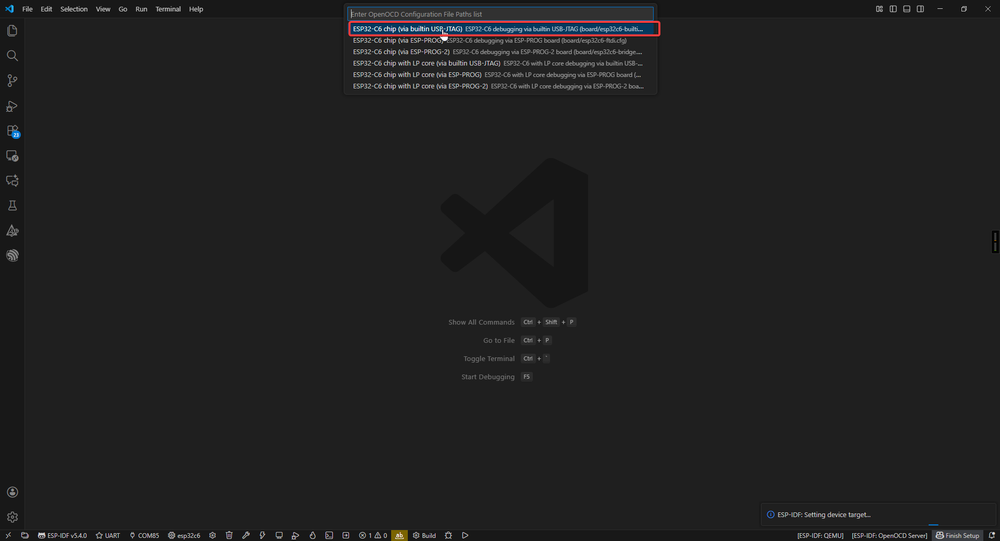
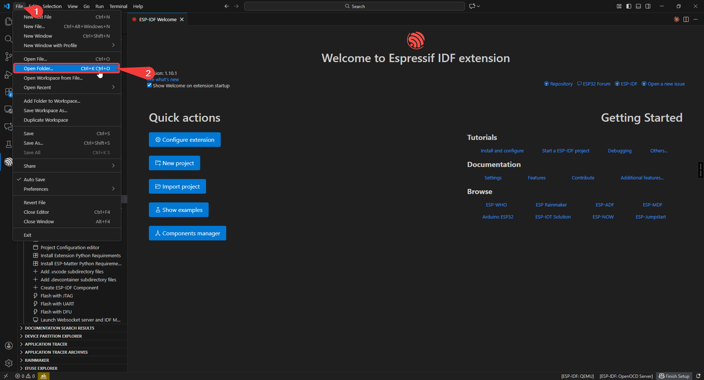
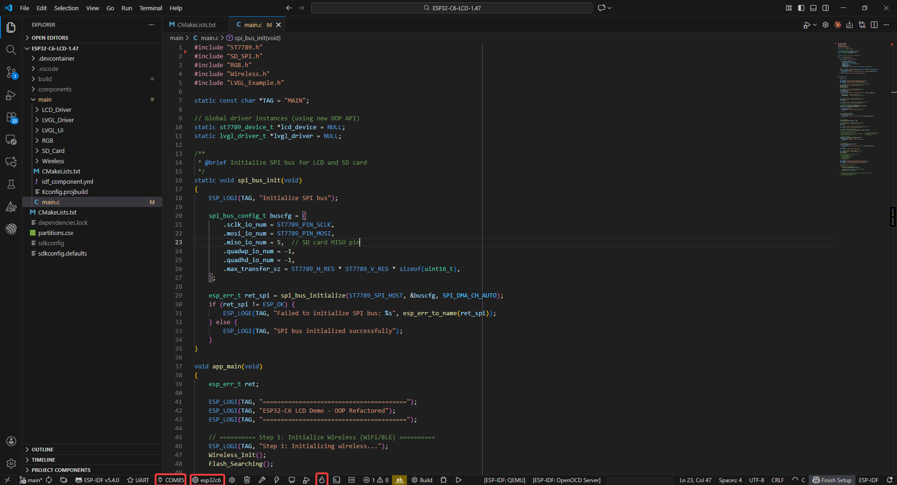
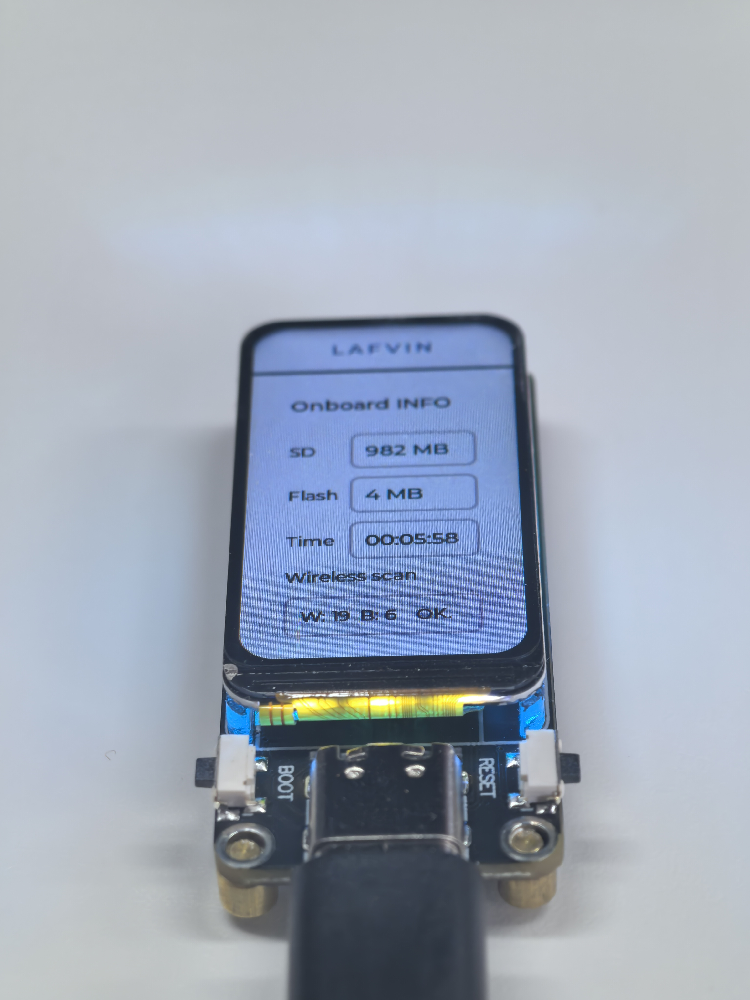

3. IDF
=================

First, in this section, we need to configure the IDF development environment. You can follow the chapters below for installation.

:ref:`install idf <idf_install>`

After installing VSCode and IDF as per the tutorial, We're ready to start configuring the project.

Project Configuration
-----------------------------------
First, you need to configure the COM port and chip model (using esp32c6 as an example).

Project Structure
-----------------
.. image:: img/idf_project.png

1. Project-level configuration (root directory):
    CMakeLists.txt: The core configuration file for project building.
     • Specifies the target chip platform (e.g., ESP32/ESP32-S3)
     • Manages project component dependencies
     • Configures global compile parameters (optimization levels, macros, etc.)
     • Sets up the cross-compilation toolchain

2. Project configuration system:
    sdkconfig: Instantiated file for project build configuration
     • Stores all configuration options from menuconfig
     • Includes critical parameters such as chip model, function modules, switches, etc.
     • Auto-generated, recommended to be modified via idf.py menuconfig

3. Application core (main directory):
    main.c: System entry file
     • Must implement the app_main() entry function
     • Plays a similar role to main()
     • The first code executed after system startup
    CMakeLists.txt: Component-level build configuration
     • Specifies the collection of source files
     • Sets header file search paths
     • Defines component dependencies

4. Storage management:
    partitions.csv: Flash storage layout definition
     • Configures partition types, start addresses, and sizes
     • Supports OTA upgrade scheme design
     • User data areas can be customized

5. Component management system (components directory):
    Built-in components: such as drivers, protocol stacks, etc.
    Third-party components: e.g., LVGL graphics library
    Custom components: project-specific functional modules

Each component follows a standard structure including:
 • Build configuration file (CMakeLists.txt)
 • Configuration options (Kconfig)
 • Source code implementation (src/)

.. image:: img/idf_workflow.png

Start Compiling and Flashing
----------------------------------
First, open VSCode and select the project example folder.

Select the example provided under ESP-IDF and click to select the folder (in the path where you downloaded the code).

.. .. image:: IDF选择文件夹图片(暂时空着)

Connect the device, select the correct COM port and model, and click the flame icon below to compile and flash it.

ESP32-C6-LCD-1.47
----------------------
This example program tests onboard device functions, integrating both the LED and LVGL libraries. After flashing, the board's LED will display random colors, and the screen will show SD card capacity, flash size, run time, and the number of nearby Bluetooth and WiFi devices.

Hardware Connection
^^^^^^^^^^^^^^^^^^^^^^^^^^^^
Insert the SD card into the development board and connect the board to your computer.

.. image:: img/connect1.png

Code Analysis
^^^^^^^^^^^^^^
.. code-block:: C++

    Wireless_Init();      // Initialize WiFi/BLE wireless communication module
    Flash_Searching();    // Test and print flash size information

    RGB_Init();           // Initialize RGB LED driver (WS2812 programmable LED)
    RGB_Example();        // Start the default rainbow gradient effect

    spi_bus_init();       // Initialize SPI bus (for LCD and SD card communication)

    // Initialize LCD hardware
    st7789_config_t lcd_config = st7789_get_default_config(); // Get default config
    lcd_device = st7789_create(&lcd_config); // Create LCD device object
    st7789_init(lcd_device); // Initialize LCD hardware
    st7789_backlight_set(lcd_device, 50); // Set backlight brightness to 50%

    SD_Init();            // Initialize SD card (SPI mode)

    // Initialize LVGL
    lvgl_config_t lvgl_config = lvgl_get_default_config(lcd_device); // Get default LVGL config (LCD device required)
    lvgl_driver = lvgl_driver_create(&lvgl_config); // Create LVGL driver object
    lvgl_driver_init(lvgl_driver); // Initialize LVGL (alloc buffer, register display driver, start timer)
    Lvgl_Example1();      // Load custom LVGL UI example (displays system information)

    // Main loop
    while (1) {
        lvgl_driver_task_handler(lvgl_driver); // Run LVGL task handler (UI refresh, animations, events)
        vTaskDelay(pdMS_TO_TICKS(10)); // Delay 10ms (recommended interval)
    }

Run Result
^^^^^^^^^^^^^^
.. image:: img/pic4.jpg

